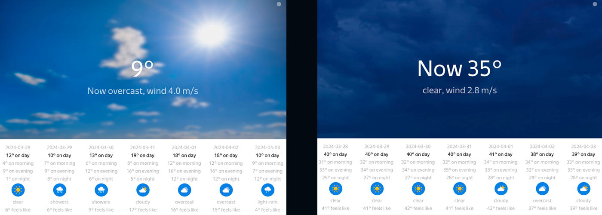

# Yandex Weather API application


This is an example of working with the Yandex Weather API to obtain the current weather or its forecast for the specified coordinates. This project was written to improve skills in the backend part, namely: working with JSON format responses, and working with the cURL library.
For visual aesthetics, a user interface was developed to visualize the interaction with data from the API.

# Installing
To clone the repository, you can simply use the universal git cloning method:
```
git clone https://github.com/soamane/Yandex-API.git
```
## Includes
**The repository includes all the necessary libraries for quickly building the project: *curl, imgui, json***

**External library files are not updated from my side, so there might be a risk of them becoming outdated in the future.**

In the additional libraries/files folder ``assets/``, there are fonts ``assets/fonts/`` and all the necessary icons ``assets/icons/`` for the proper functioning of the program.

# Usage
The usage of the program has some peculiarities:
+ **To obtain the fonts and icons, they should be located next to the executable file in folders named ``fonts/`` and ``icons/``, respectively**

  It was decided not to embed the used fonts and icons inside the program due to their large quantity.
  You can change the paths to the external files in the corresponding executable files, ``frontend/ui/extern/fonts/fonts.cpp`` and ``frontend/ui/extern/images/images.cpp``.
+ **To obtain weather conditions, only the latitude and longitude of the location are used**

  The service API does not provide data retrieval by specifying the name of a *locality, city, village, or similar*.
  Integration with the API is not possible other than using **latitude** and **longitude** in the HTTP request.

## Let's proceed to usage:
1. Compile the source file using any compiler of your choice.
2. Open the Windows command prompt.
3. Navigate to the directory containing the executable file, **as well as the folders containing the icons and fonts**.
4. Use the following command-line arguments: ```<token> <latitude> <longitude>``` To run the application, where:
    - `token` is your individual key from the Yandex developer account
    - `latitude` is the latitude of the point
    - `longitude` is the longitude of the point

----
# Optional project information
**The project is clearly divided into backend and frontend parts. Below, each part is considered in more detail, with a description of its features and other aspects**
## Backend
**The backend part involves performing HTTP/S requests to the Yandex Weather service's server, processing responses, and parsing the received information.**
+ Using the open documentation of the Yandex Weather API: https://yandex.ru/dev/weather/doc/ru/
an interface for working with it has been developed. It utilizes the capability to retrieve both current weather data and a 7-day forecast for the specified location.
+ The project utilizes the ``CURL`` library for handling web requests, and it provides a custom tool for accelerating request execution called the *HttpRequest* class.
+ The API server responds with JSON-format responses. The ``rapidjson`` library is used to process the received information. The source code also includes an implementation of a class named *Parser*, which serves as a handler for such types of responses.
+ The structure of weather conditions consists of:
  - **Weather** data structure (weather conditions at any given moment)
  - **Forecast** data structure, which contains four Weather objects for each time period of the day: *morning, day, evening, night, and the date for each forecast day*.
+ Additionally, the project utilizes predefined enumerations from the API itself for certain weather condition indicators: Cloudiness, PrecType, PrecStrength
  ```C++
    enum Cloudiness
    {
    	CLEAR,
    	PARTLY,
    	SIGNIFICANT,
    	CLOUDY,
    	OVERCAST
    };
    
    enum PrecType
    {
    	NO_TYPE,
    	RAIN,
    	SLEET,
    	SNOW,
    	HAIL
    };
    
    enum PrecStrength
    {
    	ZERO,
    	WEAK,
    	AVERAGE,
    	STRONG,
    	VERY_STRONG
    };

  ```

## Frontend
**The frontend was developed solely to enhance the visualization of processed data. The idea and goal of the project were focused on working with the service. Therefore, the design and approach to this part remain primitive.**
+ For developing the user interface, the cross-platform ImGUI library was used.
+ The UI utilizes **DirectX 11** for rendering images.
+ The source code provides ready-to-use tools for working with fonts and images. Based on them, custom fonts for text and icons for visual weather representation are loaded.
+ The font used in the repository is Yandex Sand (light, thin, medium, regular).
+ Weather icons were downloaded from the official documentation website: https://yandex.ru/dev/weather/doc/ru/concepts/icons and converted from .svg to .png format.
